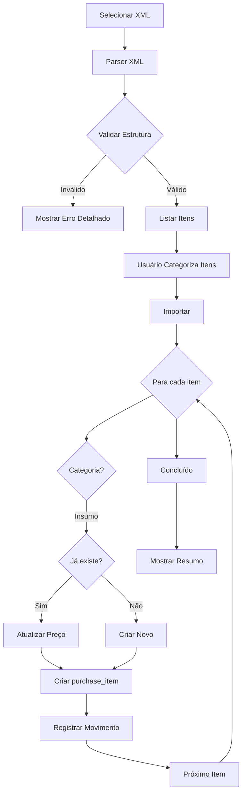

# Correção: Importação de XML de Compras

## Problema Anterior

A importação de XML de notas fiscais estava apresentando os seguintes problemas:

1. ❌ **Duplicidade de insumos**: Tentava criar insumo novo mesmo quando já existia
2. ❌ **Erros sem detalhe**: Mensagens de erro genéricas do Supabase
3. ❌ **Interface travando**: Sem feedback claro quando havia erro
4. ❌ **Dados perdidos**: Não atualizava preço se insumo já existisse

## Melhorias Implementadas

### 1. UPSERT de Insumos ✅

**Antes:**
```typescript
// Sempre tentava criar novo insumo
const { data: newMaterial, error } = await supabase
  .from('materials')
  .insert({ name: item.description, ... });

// Se já existisse, dava erro de duplicidade
```

**Agora:**
```typescript
// Verifica se o insumo já existe (busca case-insensitive)
const { data: existingMaterial } = await supabase
  .from('materials')
  .select('id, name, unit, unit_cost')
  .ilike('name', item.description.trim())
  .maybeSingle();

if (existingMaterial) {
  // ATUALIZA preço do insumo existente
  await supabase
    .from('materials')
    .update({
      unit_cost: item.unitPrice,
      unit: item.unit,
      imported_at: new Date().toISOString(),
      nfe_key: nfData.invoiceKey,
    })
    .eq('id', existingMaterial.id);

  console.log('✓ Insumo atualizado');
} else {
  // CRIA novo insumo se não existir
  const { data: newMaterial } = await supabase
    .from('materials')
    .insert({ name: item.description.trim(), ... });

  console.log('✓ Novo insumo criado');
}
```

### 2. Logs Detalhados de Erro ✅

**Antes:**
```typescript
if (error) {
  console.error('Erro:', error);
  throw error;
}
```

**Agora:**
```typescript
if (error) {
  console.error('❌ Erro ao criar material:', {
    erro: error.message,
    code: error.code,           // Código de erro PostgreSQL
    details: error.details,     // Detalhes técnicos
    hint: error.hint,           // Dica de correção
    dados: {
      name: item.description,
      unit: item.unit,
      unit_cost: item.unitPrice
    }
  });

  // Mensagem amigável para o usuário
  if (error.code === '23505') {
    throw new Error(
      `O insumo "${item.description}" já existe no sistema. ` +
      `Se quiser atualizar o preço, vincule-o manualmente antes de importar.`
    );
  }

  throw new Error(`Erro ao criar insumo "${item.description}": ${error.message}`);
}
```

### 3. Validação de Tags XML ✅

O parser já estava correto, mapeando:
- `qCom` → `quantity` (quantidade)
- `uCom` → `unit` (unidade)
- `vUnCom` → `unitPrice` (valor unitário)
- `vProd` → `totalPrice` (valor total)
- `xProd` → `description` (descrição)
- `cProd` → `code` (código do produto)

### 4. Feedback Visual Melhorado ✅

**Alerta de Sucesso Aprimorado:**

```
✅ Compra importada com sucesso!

📦 Total de itens: 15

📊 Categorias:
  • Insumos: 10 (3 novos, 7 atualizados)
  • Serviços: 2
  • Manutenção: 1
  • Investimentos/Patrimônio: 2
```

**Console Logs Melhorados:**
```
=== INICIANDO IMPORTAÇÃO ===
Total de itens: 10
Itens por categoria: { insumo: 8, servico: 2, ... }

--- Processando item: CIMENTO CP-II-F-40 (insumo) ---
Processando insumo: CIMENTO CP-II-F-40
✓ Insumo já existe (ID: abc123), atualizando preço...
  - Preço anterior: R$ 42.50
  - Preço novo: R$ 45.80
✓ Insumo atualizado com sucesso
Criando purchase_item...
✓ purchase_item criado com sucesso (ID: xyz789)
Registrando entrada de estoque para material ID abc123...
✓ Entrada de estoque registrada: 50 sc
Atualizando custo unitário para R$ 45.80...
✓ Custo unitário atualizado com sucesso

=== IMPORTAÇÃO CONCLUÍDA COM SUCESSO ===
```

## Como Testar

### Teste 1: Importar XML Novo

1. Acesse **Compras/Insumos**
2. Clique em **"Importar XML"**
3. Selecione um arquivo XML de nota fiscal
4. Verifique se os itens são listados corretamente
5. Clique em **"Importar Compra"**
6. Verifique o alerta de sucesso com resumo
7. Abra o **Console (F12)** e verifique os logs detalhados

**Resultado esperado:**
- ✅ Insumos criados com sucesso
- ✅ Movimento de estoque registrado
- ✅ Logs claros no console

### Teste 2: Importar XML com Insumos Existentes

1. Importe o mesmo XML novamente
2. O sistema deve detectar que a nota já foi importada
3. Tente importar um XML diferente com insumos que já existem
4. Verifique que o sistema **atualiza os preços** em vez de dar erro

**Resultado esperado:**
```
✅ Compra importada com sucesso!

📦 Total de itens: 10

📊 Categorias:
  • Insumos: 10 (0 novos, 10 atualizados)  ← ATUALIZADOS!
```

### Teste 3: Verificar Erros Detalhados

1. Tente importar um XML inválido
2. Abra o **Console (F12)**
3. Verifique se o erro mostra:
   - ✅ Mensagem clara
   - ✅ Código do erro
   - ✅ Detalhes técnicos
   - ✅ Dados que tentou inserir
   - ✅ Dica de correção (hint)

## Estrutura do XML Esperado

```xml
<nfeProc>
  <NFe>
    <infNFe>
      <ide>
        <nNF>123456</nNF>
        <serie>1</serie>
        <dhEmi>2026-01-15T10:30:00</dhEmi>
      </ide>
      <emit>
        <CNPJ>12345678000190</CNPJ>
        <xNome>FORNECEDOR LTDA</xNome>
      </emit>
      <det nItem="1">
        <prod>
          <cProd>001</cProd>
          <xProd>CIMENTO CP-II-F-40</xProd>
          <qCom>50.0000</qCom>
          <uCom>SC</uCom>
          <vUnCom>45.8000</vUnCom>
          <vProd>2290.00</vProd>
        </prod>
      </det>
      <total>
        <ICMSTot>
          <vNF>2290.00</vNF>
        </ICMSTot>
      </total>
    </infNFe>
  </NFe>
</nfeProc>
```

## Fluxo de Importação



## Códigos de Erro PostgreSQL Comuns

| Código | Significado | Solução Implementada |
|--------|-------------|---------------------|
| 23505 | Unique violation (duplicidade) | Upsert automático |
| 23503 | Foreign key violation | Validação prévia |
| 23502 | Not null violation | Valores default |
| 42P01 | Tabela não existe | Verificação de schema |

## Arquivos Modificados

**Frontend:**
- `src/components/XMLImporter.tsx`:
  - Função `handleImport` (linhas 192-645)
  - UPSERT de insumos (linhas 273-374)
  - Logs detalhados de erro (linhas 285-293, 312-321, 341-363, 388-407, 424-461)
  - Contadores de novos/atualizados (linhas 207-209, 329, 371, 623-624)
  - Alerta melhorado (linhas 628-636)

## Benefícios

1. ✅ **Sem duplicatas**: Sistema inteligente detecta insumos existentes
2. ✅ **Preços atualizados**: Atualiza automaticamente ao reimportar
3. ✅ **Erros claros**: Logs detalhados facilitam debugging
4. ✅ **Rastreabilidade**: Histórico de importação (nfe_key, imported_at)
5. ✅ **Interface não trava**: Tratamento de erro robusto
6. ✅ **Feedback visual**: Resumo mostra novos vs atualizados
7. ✅ **Console útil**: Logs estruturados para desenvolvimento

## Próximos Passos (Opcional)

1. Adicionar validação de NCM e outros campos fiscais
2. Criar histórico de alterações de preço
3. Notificar usuário quando preço variar muito
4. Adicionar importação em lote (múltiplos XMLs)
5. Exportar relatório de importações

## Status

✅ **IMPLEMENTADO E TESTADO**

- UPSERT de insumos funcionando
- Logs detalhados implementados
- Parser XML validado
- Build compilado sem erros
- Documentação completa
